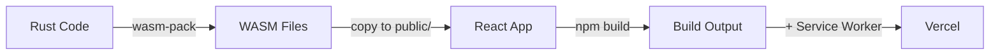

# 🚀 Build Pipeline Integration - Quick Reference

## Status Integrasi

| Component | Status | Details |
|-----------|--------|---------|
| **WASM Build** | ✅ **NOW INTEGRATED** | Auto-compile via `prebuild` script |
| **Service Worker** | ✅ Integrated | Auto-copied to build/ |
| **NPM Scripts** | ✅ Integrated | Full build automation |
| **Vercel Deploy** | ✅ Integrated | One-command deployment |

## Pipeline Flow



## Quick Commands

### Development
```bash
# Start dev server (no WASM rebuild)
npm start

# Build WASM only
npm run build:wasm

# Full build (WASM + React)
npm run build

# Preview build
npm run preview
```

### Deployment
```bash
# Deploy to Vercel
npm run deploy

# Or use the script
./deploy.sh

# Manual deployment
vercel --prod
```

## What Changed

### ✅ Added to package.json
```json
"prebuild": "npm run build:wasm",
"build:wasm": "cd src && wasm-pack build --target web --out-dir ../public",
"build:vercel": "npm run build:wasm && react-scripts build && cp public/sw.js build/"
```

### ✅ Updated vercel.json
```json
"buildCommand": "npm run build:vercel",
"installCommand": "npm install && curl ... | sh ... && cargo install wasm-pack"
```

### ✅ Enhanced deploy.sh
Now includes WASM build step with error handling.

## File Locations

```
src/
  ├── Cargo.toml              # Rust dependencies
  └── src/
      └── lib.rs              # Rust source code
                              ↓ wasm-pack build
public/
  ├── rust_backend.js         # Generated WASM bindings
  ├── rust_backend_bg.wasm    # Generated WASM binary
  └── sw.js                   # Service Worker (manually maintained)
                              ↓ npm build
build/
  ├── static/...              # React build output
  ├── rust_backend*.js        # Copied WASM files
  └── sw.js                   # Copied Service Worker
                              ↓ vercel deploy
Vercel CDN
```

## Testing Integration

Run the integration test:
```bash
./test-integration.sh
```

This checks:
- ✓ Rust installed
- ✓ wasm-pack installed
- ✓ Cargo.toml exists
- ✓ Service Worker exists
- ✓ package.json scripts
- ✓ vercel.json config
- ✓ WASM build works

## Troubleshooting

### "wasm-pack: command not found"
```bash
cargo install wasm-pack
```

### "Rust not installed"
```bash
curl --proto '=https' --tlsv1.2 -sSf https://sh.rustup.rs | sh
```

### Build fails on Vercel
Check Vercel build logs for:
- Rust installation errors
- wasm-pack installation errors
- WASM compilation errors

### WASM not loading in browser
Check browser console for:
- 404 errors on .wasm files
- MIME type errors
- CORS errors

## What Happens on `npm run build`

1. **prebuild** runs automatically
   - Calls `npm run build:wasm`
   - Compiles `src/src/lib.rs` → `public/rust_backend_bg.wasm`

2. **build** runs
   - React build process
   - Copies WASM files from public/ to build/

3. **postbuild** runs
   - Copies `public/sw.js` to `build/sw.js`

4. Result: Ready-to-deploy `build/` directory

## What Happens on Vercel Deploy

1. **Install phase**
   - `npm install`
   - Install Rust toolchain
   - Install wasm-pack

2. **Build phase**
   - Run `npm run build:vercel`
   - WASM compiled
   - React app built
   - Service Worker copied

3. **Deploy phase**
   - Upload to CDN
   - Configure headers
   - Activate deployment

## Before Deploying

- [ ] Test locally: `npm run build && npm run preview`
- [ ] Check WASM loads in browser console
- [ ] Test crawler features work
- [ ] Test PDF download
- [ ] Test Service Worker registration

## After Deploying

- [ ] Open Vercel URL
- [ ] Check browser console for WASM messages
- [ ] Test "Crawl & Process" feature
- [ ] Test "Process Only" feature
- [ ] Verify Service Worker active
- [ ] Test PDF downloads work

---

**Integration Status:** ✅ **FULLY AUTOMATED**  
**Last Updated:** November 28, 2025
